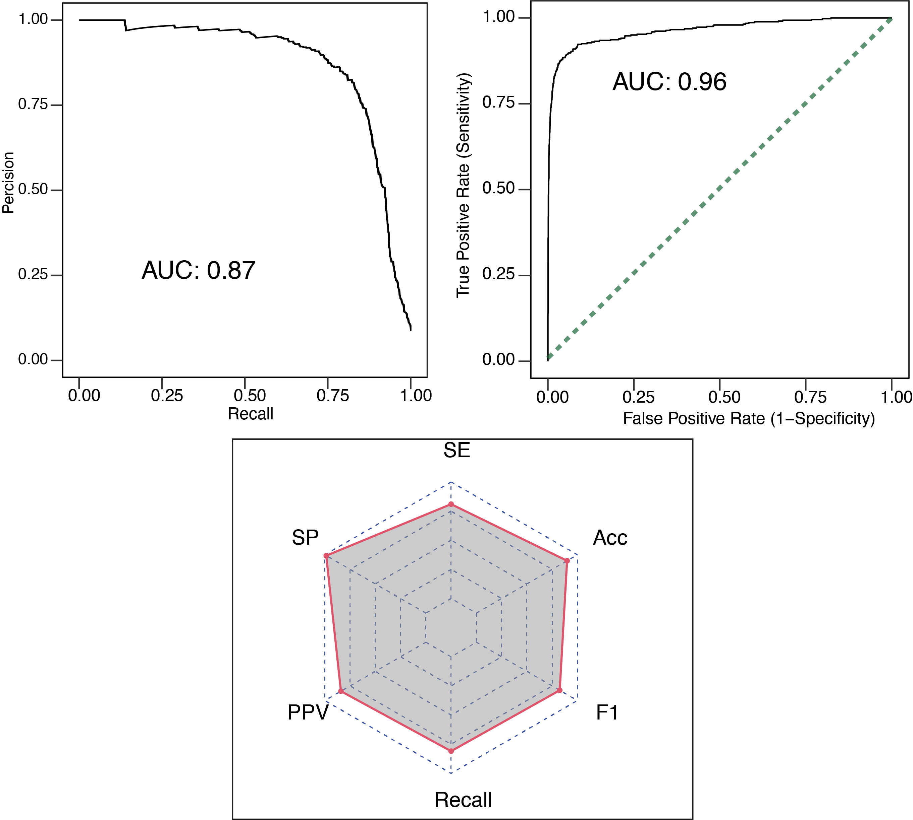

```{r echo=FALSE,message=FALSE, warning=FALSE}
library("knitr")
```


```{r setup, include = FALSE}
knitr::opts_chunk$set(echo = TRUE)
```

# Abstract
Emerging infectious diseases, including zoonoses, pose a significant threat to 
public health and the global economy, as exemplified by the COVID-19 pandemic 
caused by the zoonotic severe acute respiratory syndrome coronavirus 2 
(SARS-CoV-2). Understanding the protein-protein interactions (PPIs) between 
host and viral proteins is crucial for identifying targets for antiviral 
therapies and comprehending the mechanisms underlying pathogen 
replication and immune evasion. Experimental techniques like yeast 
two-hybrid screening and affinity purification mass spectrometry have 
provided valuable insights into host-virus interactomes. However, these 
approaches are limited by experimental noise and cost, resulting in 
incomplete interaction maps. Computational models based on machine learning 
have been developed to predict host-virus PPIs using sequence-derived 
features. Although 
these models have been successful, they often overlook the semantic information 
embedded in protein sequences and require effective encoding schemes.
Here, we introduces DeProViR, a deep learning (DL) framework that predicts 
interactions between viruses and human hosts using only primary amino acid 
sequences. DeProViR employs a Siamese-like neural network architecture, 
incorporating convolutional and bidirectional long short-term memory (Bi-LSTM) 
networks to capture local and global contextual information. It utilizes 
GloVe embedding to represent amino acid sequences, allowing for the 
integration of semantic associations between residues. The proposed framework 
addresses limitations of existing models, such as the need for feature 
engineering and the dependence on the choice of encoding scheme.
DeProViR presents a promising approach for accurate and efficient prediction 
of host-virus interactions and can contribute to the development of antiviral 
therapies and understanding of infectious diseases.


# Proposed Framework
The DeProViR framework is composed of a two-step automated computational 
workflow: (1) Learning sequence representation of both host and viral proteins 
and (2) inferring host-viral PPIs through a hybrid deep learning architecture. 
More specifically, in the first step, host or virus protein sequences are 
separately encoded into a sequence of tokens via a tokenizer and padded to 
the same length of size 1000 with a pad token. The embedding matrix *E*  
of 100-dimension is then generated by applying the unsupervised GloVe 
embedding model to a host or viral profile representation to 
learn the implicit yet low-dimensional vector space based on the corpus of 
tokens. Next, the embedding layer is fed with sequences of integers, 
i.e., amino acid token indexes, and mapped to corresponding pre-trained 
vectors in the GloVe embedding matrix *E*, which turns the tokens into a 
dense real-valued 3D matrix M. In the subsequent step, DeProViR uses a 
Siamese-like neural network architecture composed of two identical 
sub-networks with the same configuration and weights. Each sub-network combines 
convolution and recurrent neural networks (bidirectional Bi-LSTM) to capture 
amino acids' local and global contextual relatedness accurately. 

To achieve the best-performing DL architecture, we fine-tuned the 
hyper-parameters for each block on the validation set by random search 
employing auROC as the performance metric. We determined the number of epochs 
through an early stopping strategy on the validation set, with a patience 
threshold set to 3. The optimized DL architecture achieved an auROC of 0.96 
using 5-fold cross-validation and 0.90 on the test set. This architecture 
includes 32 filters (1-D kernel with size 16) in the first CNN layer to 
generate a feature map from the input layer (i.e., embedding matrix *M*) 
through convolution operation and non-linear transformation of its input with 
the ReLU activation function. Next, the hidden features generated by the first 
convolution layer are transformed to the second CNN layer with 64 filters 
(1-D kernel with size seven) in the same way. After the convolutional layers, 
the k-max pooling layer is added to perform max pooling, where k is set to 
30. Subsequently, the flattened pooling output is fed into a 
bidirectional LSTM consisting of 64 hidden neurons, which finally connects to a 
fully dense layer of 8 neurons that connects to the output layer with the 
sigmoid activation function to output the predicted probability score.  


# Vignette Overview
The modular structure of this package is designed in a way that allows users 
the flexibility to either utilize their own training set or 
load a fine-tuned pre-trained model that constructed previously (see previous
section). This dual capability empowers researchers to tailor their model 
development approach to their specific needs and preferences.

In the first approach, users can use their own training data to train a model 
tailored to their specific needs and subsequently apply the trained model to 
make predictions on uncharted interactions. This capability proves particularly 
valuable when users wish to undertake diverse tasks, such as predicting 
interactions between host and bacterial pathogens, drug-target interactions, 
or protein-protein interactions, etc.

Alternatively, the second approach streamlines the process by allowing users to 
leverage a fine-tuned pre-trained model. This model has undergone training on a 
comprehensive dataset, as detailed in the [accompanying paper](https://www.sciencedirect.com/science/article/pii/S2001037019304295),
achieving an auROC > 90 in both cross-validation and external test sets.
In this scenario, users simply upload the pre-trained model and initiate 
predictions without the need for additional training. This approach offers 
the advantage of speed and convenience since it bypasses the time-consuming 
training phase. By employing a pre-trained model, users can swiftly obtain 
predictions and insights, making it a time-efficient option for their 
research needs.

It's important to note that for the second approach, a random search strategy 
has been employed to meticulously tune all possible hyperparameters of the 
pre-trained model. This tuning process ensures the acquisition of the 
best-performing for the given training set. However, if you intend to alter 
the training input, we strongly recommend that you exercise caution and 
take the time to carefully fine-tune the hyperparameters using 
[tfruns](https://tensorflow.rstudio.com/reference/tfruns/) to achieve 
optimal results. 

# First Approach
The `ModelTraining` function included in this package allows users to update 
the training dataset. It begins by converting protein sequences into amino 
acid tokens, where tokens are mapped to positive integers. Next, it represents 
each amino acid token using pre-trained co-occurrence embedding vectors 
acquired from GloVe. Following this, it utilizes an embedding layer to convert 
a sequence of amino acid token indices into dense vectors based on the GloVe 
token vectors. Finally, it leverages a Siamese-like neural network architecture 
for model training, employing a k-fold cross-validation strategy. Please ensure 
that the newly imported training set adheres to the format of the sample 
training set stored in the **inst/extdata/trainingSet** directory of 
the DeProViR package.

The `ModelTraining`  function takes following parameters:

- `url_path`  URL path to GloVe embedding. Defaults to 
"https://nlp.stanford.edu/data".
See `\code{\link[DeProViR]{gloveEmb_import}}`. 

- `training_dir` Directory containing viral-host training set.
`See \code{\link[DeProViR]{load_TrainingSet}}`. 
Defaults to `inst/extdata/training_Set`.

- `input_dim` Integer. Size of the vocabulary, i.e. amino acid
tokens. Defults to 20. See `\code{keras}`.

- `output_dim` Integer. Dimension of the dense embedding,
i.e., GloVe. Defaults to 100. See `\code{keras}`.

- `filters_layer1CNN` Integer, the dimensionality of the output space
(i.e. the number of output filters in the first convolution).
Defaults to 32. See `\code{keras}`.

- `kernel_size_layer1CNN` An integer or tuple/list of 2 integers,
specifying the height and width of the convolution window in the first
layer. Can be a single integer to specify the same value for all
spatial dimensions.Defaults to 16. See `\code{keras}`.

- `filters_layer2CNN` Integer, the dimensionality of the output space
(i.e. the number of output filters in the second convolution).
Defaults to 64. See `\code{keras}`.

- `kernel_size_layer2CNN` An integer or tuple/list of 2 integers,
specifying the height and width of the convolution window in the second layer. 
Can be a single integer to specify the same value for all spatial dimensions.
Defaults to 7. See `\code{keras}`.

- `pool_size` Down samples the input representation by taking the
maximum value over a spatial window of size pool_size.
Defaults to 30. See `\code{keras}`.

- `layer_lstm` Number of units in the Bi-LSTM layer. Defaults to 64.
See `\code{keras}`.

- `units` Number of units in the MLP layer. Defaults to 8. See `\code{keras}`.
- `metrics` Vector of metric names to be evaluated by the model
during training and testing. Defaults to "AUC". See `\code{keras}`.

- `cv_fold` Number of partitions for cross-validation. Defaults to 10.
- `epochs` Number of epochs to train the model. Defaults to 100.
See `\code{keras}`.

- `batch_size` Number of samples per gradient update.Defults to 128.
See `\code{keras}`.

- `plots` PDF file containing plots of tge predicitve learning algorithms 
achived via cross-validatiob. Defaults to TRUE.
See `\code{\link[DeProViR]{ModelPerformance_evalPlots}}`.

- `tpath` A character string indicating the path to the project
directory. If the directory is missing, PDF file containing performance
measures will be stored in the Temp directory.
See `\code{\link[DeProViR]{ModelPerformance_evalPlots}}`.
   
   
- `save_model_weights` If TRUE, it allows users to save the trained weights.
Defaults to TRUE. See `\code{keras}`.

- `filepath` A character string indicating the path to save the model weights
after training. Default to tempdir(). See `\code{keras}`.

To run ModelTraining, we can use the following commands:

```{r, message=FALSE, warning=FALSE, eval=FALSE}

options(timeout=240)
library(tensorflow)
library(data.table)
library(DeProViR)

tensorflow::set_random_seed(101)
model_training <- ModelTraining(
      url_path = "https://nlp.stanford.edu/data",
      training_dir = system.file("extdata", "training_Set",
                              package = "DeProViR"),
      input_dim = 20,
      output_dim = 100,
      filters_layer1CNN = 32,
      kernel_size_layer1CNN = 16,
      filters_layer2CNN = 64,
      kernel_size_layer2CNN = 7,
      pool_size = 30,
      layer_lstm = 64,
      units = 8,
      metrics = "AUC",
      cv_fold = 5,
      epochs = 100,
      batch_size = 128,
      plots = FALSE,
      tpath = tempdir(),
      save_model_weights = FALSE,
      filepath = tempdir()) 
```

When the plots argument set to TRUE, the `ModelTraining` function generates one 
pdf file containing three figures as shown below indicating the performance of 
the DL model using k-fold cross-validation.


  <p align="right"> 


# Second Approach
In this context, users have the option to employ the `Load_PreTrainedModel` 
function to load the finely-tuned pre-trained model for predictive purposes. 

```{r message=FALSE, warning=FALSE}
options(timeout=240)
library(tensorflow)
library(data.table)
library(DeProViR)
pre_trainedmodel <- 
   Load_PreTrainedModel()

```


# Viral-Host Interactions Prediction 
The models that have undergone training can subsequently be leveraged to 
generate predictions on unlabeled data, specifically on interactions that are 
yet to be identified. This can be achieved by executing the following commands:

```{r}
#load the demo test set (unknown interactions)
testing_set <- fread(
   system.file("extdata", "test_Set", "test_set_unknownInteraction.csv",
                                           package = "DeProViR"))
scoredPPIs <- predInteractions( 
    url_path = "https://nlp.stanford.edu/data",
                 testing_set,
                 trainedModel = pre_trainedmodel)
scoredPPIs

```


```{r warning=FALSE, message=FALSE, eval=FALSE}
# or using the newly trained model 
predInteractions(url_path = "https://nlp.stanford.edu/data",
                 testing_set,
                 trainedModel = model_training)

```


# Session information

```{r, eval=TRUE}
sessionInfo()
```
